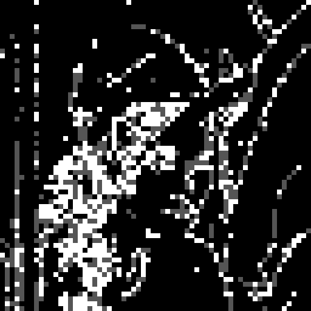
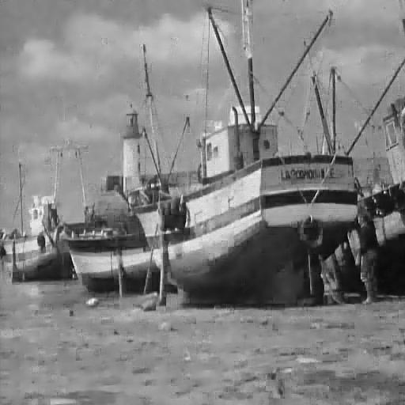
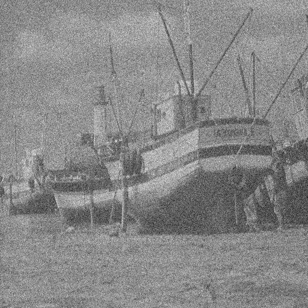

# Image Denoising Via Sparse and Redundant Dictionary Learning and Non-Local Means Filter

# Introduction

In this project, we mainly focus on removing the additive zero-mean white and homogeneous Gaussian noise from given images. We investigate KSVD and non-local means methods and make extensions by using multiple dictionaries on **preclassified image patches** and adding **non-local regularization** to optimization task.

# Software
Matlab

# Demo
Run:

* The demo of KSVD with patch preclassification: [ksvdcdemo.m](./ksvdcdemo.m). 
  
* The demo of KSVD with non-local means regularization: [ksvd_nlmdemo.m](./ksvd_nlmdemo.m). 

* The demo of KSVD with both patch preclassification and non-local means regularization: [ksvdc_nlm.m](./ksvd_nlmdemo.m).

Folder of other used functions: [lib](./lib) folder.

Folder of used images: [img](./img) folder.

We test classifying image patches using [classifytest.m](./test/classifytest.m). To run the demo, download [img](./img), [lib](./lib), [ksvdcdemo.m](./ksvdcdemo.m), [ksvd_nlmdemo.m](./ksvd_nlmdemo.m) and [ksvdc_nlm.m](./ksvd_nlmdemo.m) and put them in the same folder. The image and noise level sigma used could be changed by editing the demo files.

# Usage

KSVD method:
[Xhat,output] = denoiseImageKSVD(Y, sigma,K);

KSVD with non local regularization:
[Xhat,output] = denoiseImageKSVD_nlm(Y, sigma,K);

Input:
> Y - noised image.
> 
> sigma - parameter to generate noise.
> 
> K - number of atoms in the dictionary.

Output:
> Xhat - denoised image.
> 
> output - parameters.

# Results

The result of patch classification on lena image is shown below.

The result of KSVD with patch preclassification and non-local means regularization on boat image with noise level sigma = 20 and sigma = 50 shown below.

Original image, noisy image with sigma = 20 and denoised image.

Original image, noisy image with sigma = 50 and denoised image.

The result of testing on boat image is shown below.

| PSNR | Noisy image | KSVD |Non-local means |Patch preclassification| Non-local means regularization| Both
| ------------- | :-------------: | :-------------: | :-------------: | :------------: | :-------------: | :-------------: |
| sigma = 20 |22.1dB  | 30.4dB | 26.8dB | 29.2dB| 30.3dB| 29.3dB|
| sigma = 50 |12.1dB  | 25.9dB | 22.5dB | 24.5dB| 26.0dB| 24.5dB|

# Analysis

Our extentions fail to improve the performance of image denoising.:cold_sweat:

# Reference
The code is developed based on 

K-SVD: https://github.com/jbhuang0604/SelfSimSR/tree/master/Lib/KSVD

NLM: https://www.mathworks.com/matlabcentral/fileexchange/52018-simple-non-local-means-nlm-filter

