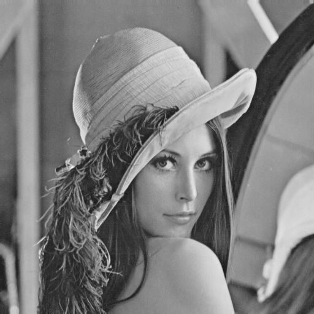
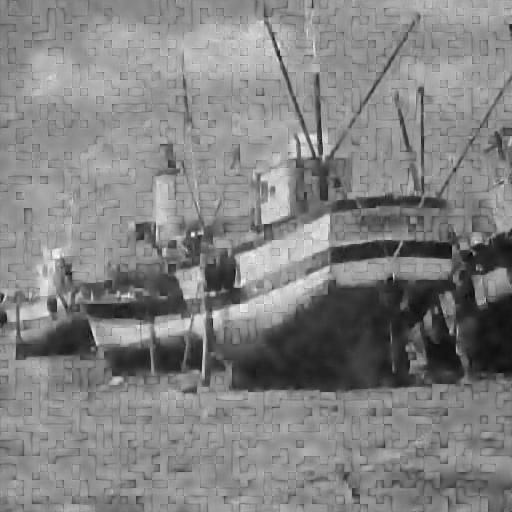

# Image Denoising Via Sparse and Redundant Dictionary Learning and Non-Local Means Filter

# Introduction

> In this project, we mainly focus on removing the additive zero-mean white and homogeneous Gaussian noise from given images. We investigate KSVD and non-local means methods and make extensions by using multiple dictionaries on **preclassified image patches** and adding **non-local regularization** to optimization task.

# Software
Matlab

# Usage
Run multidksvddemo2.m

KSVD method:
[Xhat,output] = multidictionaryKSVDtest(Y, sigma,K);

Input:
Y - noised image
sigma - parameter to generate noise
K - number of atoms in the dictionary
Output:
Xhat - denoised image
output - parameters

# Demo

> We test classifying image patches using [classifytest.m](./classifytest.m).

> The KSVD method with multiple dictionaries based on patch classification is implemented in [multidksvddemo.m](./multidksvddemo.m). The KSVD method with non-local means regularization is implemented in ?. The KSVD method with both patch classification and non-local means regularization is implemented in ?.

# Results

> The result of patch classification on lena image is shown below.

> The result of multiple dictionaries KSVD on boat image with noise level sigma = 20 and sigma = 50 shown below.

Original image, noisy image with sigma = 20 and denoised image.

Original image, noisy image with sigma = 50 and denoised image.

> The result of testing on boat image is shown below.

| PSNR | Noisy image | KSVD |non-local means |Multiple dictionary on preclassified patch| Non-local means regularization| Both
| ------------- | :-------------: | :-------------: | :-------------: | :------------: | :-------------: | :-------------: |
| sigma = 20 |22.1dB  | 30.4dB | 26.8dB | 29.2dB| ?dB| ?dB|
| sigma = 50 |12.1dB  | 25.9dB | 22.5dB | 24.5dB| ?dB| ?dB|
# Analysis

> Our extentions fail to improve the performance of image denoising.:cold_sweat:
